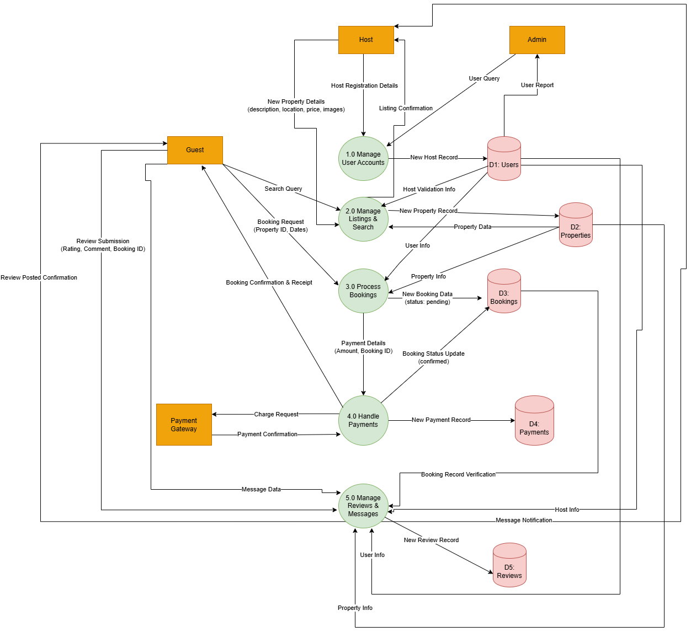

# Airbnb Clone Backend: Data Flow Diagram (DFD)

This diagram shows how data moves through our Airbnb-clone backend.

## 1. Overview

A Data Flow Diagram provides a visual representation of the flow of information within a system. Unlike an ERD that shows the static data structure, a DFD focuses on the dynamic journey of data: where it originates, how it is processed, and where it is stored.

This Level 1 DFD breaks down the system into its major sub-processes and shows how they interact with external entities and data stores.

### Key Components:

* **External Entity (Square):** Represents an actor outside the system that sends or receives data (e.g., `Guest`, `Host`, `Payment Gateway`).
* **Process (Circle):** Represents a function within the system that transforms data (e.g., `Process Bookings`).
* **Data Store (Open-Ended Rectangle):** Represents a place where data is held, such as a database table (e.g., `D1: Users`).
* **Data Flow (Arrow):** Represents the movement of data. Each arrow is labeled to describe the data being transferred.

## 2. System Data Flow Diagram

The following diagram illustrates the key data flows for major operations like user registration, property searching, booking, and payment processing.

---

### How to Interpret the Diagram:

Follow the labeled arrows to trace the path of data. For example, the "Booking Process" begins with a `Guest` sending a `Booking Request` to the `Process Bookings` function. This function then interacts with the `Users` and `Properties` data stores, creates a new record in the `Bookings` store, and passes information to the `Handle Payments` process, which continues the flow.