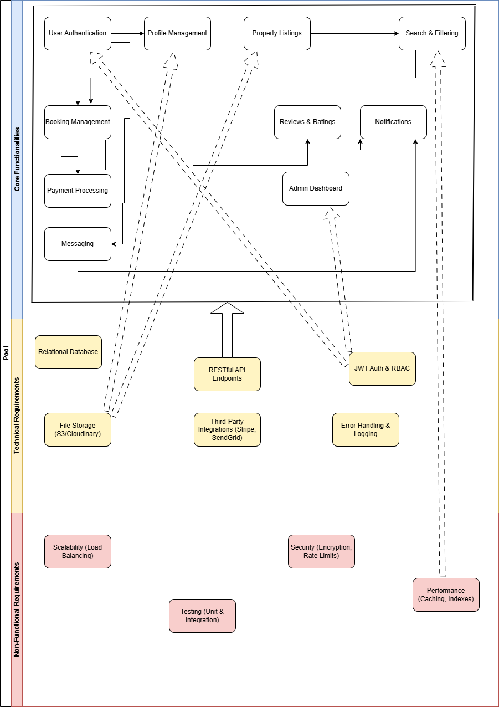

# Airbnb Clone: Backend System Design & Features

This document outlines the complete feature set and technical architecture for the backend of the ALX Airbnb Clone project. It serves as the foundational blueprint for development, detailing the system's capabilities, the technology stack, and the quality standards it must meet.

---

## 1. Core Service Areas

These are the primary user-facing services the backend will provide, grouped by functionality.

### Account & Profile Management
* **User Authentication:** Secure, token-based registration and login system. Supports email/password credentials and social OAuth (Google, Facebook) for a seamless user experience. Uses JSON Web Tokens (JWT) for managing stateless sessions.
* **Profile Management:** Full CRUD (Create, Read, Update, Delete) capabilities for user profiles, allowing users to manage personal information, contact details, and upload profile photos.
* **Role-Based Access (RBAC):** Differentiates permissions between `guest`, `host`, and `admin` roles to ensure users can only access appropriate functionalities.

### Property & Search
* **Property Listings Management:** Enables hosts to list, update, and remove properties. Includes management of details like descriptions, amenities, pricing, and image galleries.
* **Advanced Search & Filtering:** A powerful search endpoint allowing users to find properties based on location, price range, number of guests, available dates, and specific amenities. Includes pagination for efficient data handling.

### Booking, Payment & Review Lifecycle
* **Booking Engine:** Manages the entire booking process from request to completion. Includes critical logic to prevent date overlaps and double-bookings, ensuring data integrity. Tracks booking status through its lifecycle (`pending`, `confirmed`, `completed`, `canceled`).
* **Secure Payment Processing:** Integrates with trusted third-party payment gateways (e.g., Stripe) to securely handle guest payments and manage scheduled payouts to hosts.
* **Reviews & Ratings System:** Allows guests to submit reviews and ratings (1-5) for properties only after a booking is completed, ensuring authenticity.

### Communication
* **Direct Messaging:** A private messaging system for direct communication between guests and hosts.
* **Notifications:** An automated notification system (via email or in-app) to alert users about critical events such as booking confirmations, payment receipts, new messages, and cancellations.

---

## 2. Technical Architecture & Stack

This section details the technology and patterns used to build and support the core services.

* **Database:** A robust relational database (MySQL/PostgreSQL) serves as the single source of truth for all application data.
* **API Design:** A RESTful API provides a clean, predictable interface between the backend and any client (web or mobile). It uses standard HTTP methods (`GET`, `POST`, `PUT`, `DELETE`) and status codes.
* **Cloud File Storage:** Secure, scalable cloud storage (AWS S3 or Cloudinary) for hosting all user-generated media like profile pictures and property images, keeping the database lean.
* **Third-Party Services:** Leverages industry-standard services for specialized tasks: **Stripe** for payments and **SendGrid/Mailgun** for transactional emails.
* **Error Handling & Logging:** A centralized system for handling exceptions gracefully and logging critical information for debugging and monitoring.

---

## 3. System-Wide Quality Standards

These are the non-functional requirements that ensure the system is reliable, secure, and fast.

* **Security:** A primary concern, addressed through password hashing (bcrypt), data encryption for sensitive information, and rate limiting to prevent abuse.
* **Performance:** Optimized for speed and responsiveness using database query optimization, indexing on frequently accessed columns, and a caching layer (Redis) for search results.
* **Scalability:** Designed with a modular architecture that allows for horizontal scaling (adding more servers) and managed by a load balancer to distribute traffic efficiently.
* **Reliability & Testing:** Ensured through a comprehensive testing strategy, including unit tests for individual functions and integration tests for end-to-end workflows.

---

## 4. System Architecture Diagram

The following diagram visually represents how all these components and features interconnect.

