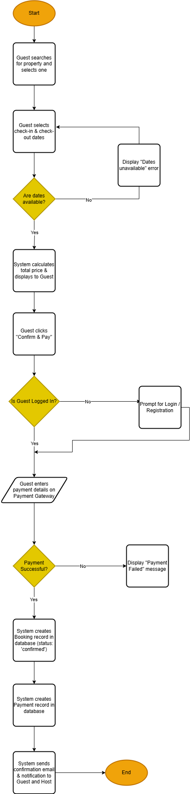

# Airbnb Clone Backend: Process Flowcharts

This directory contains flowcharts that visualize the step-by-step logic of key backend processes for the ALX Airbnb Clone project.

## 1. Overview

A flowchart is a diagram that depicts a workflow or process. It shows the individual steps as boxes of various kinds, and their order by connecting them with arrows. This type of diagram provides a clear, easy-to-understand breakdown of how a specific task is accomplished from start to finish, including decisions and alternative paths.

### Key Components:

* **Terminator (Oval):** Represents the start and end points of the process.
* **Process (Rectangle):** Represents a single action or computation.
* **Decision (Diamond):** Represents a point where the logic branches based on a condition (e.g., Yes/No).
* **Data (Parallelogram):** Represents data input or output.

## 2. Property Booking Process Flowchart

The diagram below illustrates the complete workflow for the property booking process, from the guest's initial date selection to the final confirmation after a successful payment.

---

### How to Interpret the Diagram:

Follow the arrows from the `Start` node to trace the sequence of events. The diamond shapes represent logical checks performed by the system (e.g., checking date availability, verifying payment). The paths branching from these diamonds show how the system handles both success and failure scenarios, ensuring a robust process.