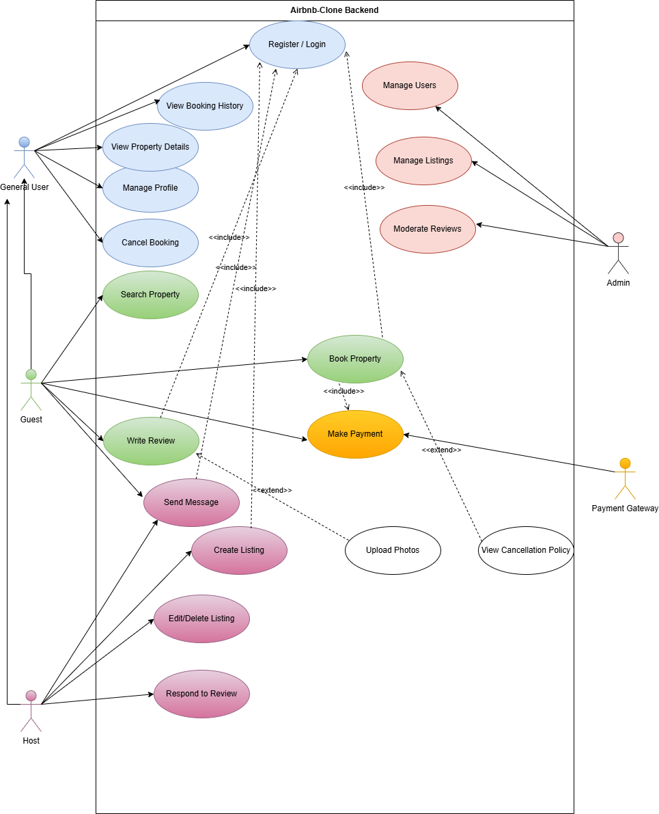

# Airbnb Clone Backend: Use Case Diagram

This document provides a Use Case Diagram that visualizes the interactions between different users (actors) and the core functionalities of the ALX Airbnb Clone backend system.

## 1. Overview

A Use Case Diagram is a behavioral diagram that shows how a system will be used. It captures the goals of the users and the responsibilities of the system to meet those goals. This diagram is essential for understanding the scope of the project from a user-centric perspective.

### Key Components:

* **Actors:** The stick figures represent users or external systems that interact with our backend. We have identified four primary actors:
    * **Guest:** A user who searches, books, and reviews properties.
    * **Host:** A user who lists and manages properties and their bookings.
    * **Admin:** A privileged user responsible for platform oversight.
    * **Payment Gateway:** An external system (like Stripe or PayPal) that processes payments.
* **System Boundary:** The large rectangle represents the scope of our Airbnb Clone backend. All use cases are contained within this boundary.
* **Use Cases:** The ovals represent specific actions or goals that an actor can perform with the system, such as "Book Property" or "Manage Listings".
* **Relationships:** The diagram also shows advanced UML relationships like **inheritance** (a Guest *is a* type of User), **`<<include>>`** (for mandatory sub-tasks), and **`<<extend>>`** (for optional functionality).

## 2. System Use Case Diagram

The following diagram illustrates the key interactions for the platform.

---

### How to Interpret the Diagram:

Lines connect an **Actor** to a **Use Case**, indicating that the actor initiates or participates in that specific interaction. This diagram helps clarify which roles are responsible for which actions and ensures that all required functionalities are mapped to a user goal.